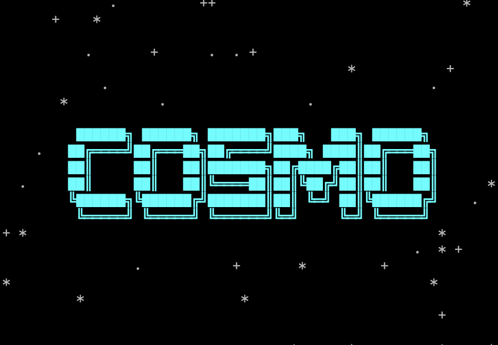

# Cosmo



A personal arXiv paper filter with a terminal UI. Cosmo fetches new papers
across the full range of physics categories, summarizes and embeds them,
learns my preferences and displays what I'd like to read from my own labels, and automatically emails me the top picks each day — so I don't have to scroll arXiv listings manually anymore.

## Why

I have a physics background (ion traps, MR-TOF-MS instrumentation, ATLAS/Higgs
detector work) and wanted something better than manually skimming arXiv
listings across a dozen categories every day. Cosmo is both a practical daily
tool to stay in touch with the field while also improving my ML skills with building an
end-to-end applied pipeline (embeddings → classification → active learning
→ automated delivery).

## The app

Cosmo runs as a [Textual](https://github.com/Textualize/textual) TUI (`app.py`),
styled with a Tokyo Night theme. Launch it with `python app.py` (or `cosmo`,
if you've run `install.sh` — see Setup).

| Screen | What it does |
|---|---|
| **Welcome** | ASCII "COSMO" banner + starfield. Smart-continues into fetching, labeling, or the choice menu depending on whether today's papers are ready and whether the labeling goal is met. |
| **Categories** | Checkbox multi-select over every arXiv physics category, grouped into collapsible sections (astro-ph, cond-mat, nlin, physics, and other core categories like `hep-ph`/`quant-ph`/`gr-qc`). Selection is saved and reused automatically. You can also list preferred authors here — any paper by a listed author is always included in your daily email regardless of classifier score (matched by first initial + last name). |
| **Fetch** | Runs fetch → summarize → embed as a background worker, with a log, progress bar with ETA, and Terraria-style flavor text while it works. |
| **Label** | Interactive labeling loop (`y`/`n`/`s`/`b`, plus `d`/`r` for on-demand explanations, `o` to open the paper in your browser). Tracks progress toward a baseline goal of 50 "interesting" + 50 "not interesting" labels; switches from progress bars to plain running counts once that goal is met. |
| **Choice menu** | Once the baseline goal is hit: **Cosmo Papers** (browse the classifier's top 10 picks), **Daily Labeling** (a quick 5-paper active-learning session), or **Indefinite Labeling** (keep going with no set goal). |
| **Cosmo Papers** | Browse the classifier's top-scored unlabeled papers. `s` stars a paper — writing it to `labels.csv` as a *triple-weighted* positive label — `x` marks it not interesting. |
| **Daily Labeling** | Uses uncertainty sampling to pick the 5 papers the classifier is least confident about — the highest-value 5 minutes of labeling you can do. Completing it shows a congratulations screen with streak tracking, current classifier accuracy, an "on this day in physics" fact, and a physics pun. |
| **Settings** (`g` from anywhere) | Email opt-in, address, daily/weekly frequency (+ weekday), how many papers to send, and desktop notification toggle. |

Every screen has a `h` help overlay listing its keybindings, and quitting is
always safe — labels flush to disk immediately, so nothing is lost mid-session.

## Pipeline

```
fetch → summarize → embed → classify → label / review → email
```

| Stage | Script | What it does |
|---|---|---|
| Fetch | `fetch.py` | Pulls new papers from arXiv's daily RSS feed for whichever categories are selected; aware of weekends/holidays when arXiv doesn't post. |
| Summarize | `summarize.py` | Plain-language abstract summaries via a local seq2seq model, with LaTeX cleanup so equations don't garble output. |
| Embed | `embed.py` | SPECTER embeddings (`sentence-transformers/allenai-specter`) for every paper, incremental — only new papers get re-embedded. |
| Classify | `classify.py` | Trains a logistic regression classifier on frozen embeddings against `labels.csv`; also scores unlabeled papers and picks out the ones the classifier is most uncertain about, for active-learning-style labeling. |
| Label / Review | `label.py`, `review.py` | Interactive labeling (with on-demand explanations via `api.py`), and classifier-ranked review — this is what powers the Label, Cosmo Papers, and Daily Labeling screens. |
| Email | `cosmo_email.py` | Trains the classifier, scores the day's fetch, and emails the top picks. Can run standalone (for scheduled/automated runs) or get triggered from within the app after a fetch completes. |

## Automated daily email

`cosmo_email.py` is a standalone script (`run_daily_pipeline()`) that fetches,
summarizes, embeds, and — if you've opted in via Settings — emails your top
picks, all without opening the app. It:

- Skips days arXiv doesn't post (weekends/holidays)
- Only runs once per day (tracked via `last_auto_run_date` in `preferences.json`)
- Sends daily or on a chosen weekday, with a configurable number of papers per email (default 10)
- Always includes papers by any preferred author, in their own section at the top of the email, on top of the configured paper count
- Sends via Gmail SMTP using an app password (`gmail_credentials.txt`, gitignored)
- Optionally fires a desktop notification (via `plyer`, if installed) when an email goes out

`app.py` auto-installs a background scheduled task for this on launch (via
`scheduler_setup.py`), so once it's set up once, the daily email keeps running
even when Cosmo isn't open.

## Setup

**Quick install (macOS/Linux, or Windows via Git Bash/WSL):**
```bash
curl -L https://github.com/tj-griffiths/Cosmo-ArXiv-Filter/archive/refs/heads/main.zip -o cosmo.zip && unzip cosmo.zip && rm cosmo.zip && cd Cosmo-ArXiv-Filter-main && pip install -r requirements.txt && chmod +x install.sh && ./install.sh
```

**Windows (PowerShell), no Git Bash needed:**
```powershell
Invoke-WebRequest -Uri https://github.com/tj-griffiths/Cosmo-ArXiv-Filter/archive/refs/heads/main.zip -OutFile cosmo.zip; Expand-Archive cosmo.zip -DestinationPath .; Remove-Item cosmo.zip; cd Cosmo-ArXiv-Filter-main; pip install -r requirements.txt; .\install.ps1
```
(`install.sh` sets up a shell alias, which PowerShell doesn't use the same way — run `python app.py` directly, or add your own PowerShell function/alias if you'd rather not.)

**Using conda instead of pip:** after extracting (either command above, skipping the `pip install` step), run:
```bash
conda env create -f environment.yml
conda activate cosmo
```

Either way, you'll still need the manual pieces below — they're personal credentials, not something an installer can fill in for you.

- **`user_config.txt`** (gitignored) — your email, used to build a polite `User-Agent` string for arXiv requests. One line: `your.email@example.com`
- **`gmail_credentials.txt`** (gitignored) — sender Gmail address, then a Gmail [app password](https://myaccount.google.com/apppasswords), for the daily email:

```
  your.email@gmail.com
  abcdabcdabcdabcd
```

  (the app password is the 16-character code Google generates, not your regular password — spaces shown on Google's site can be included or stripped, either works)
- **`groq_api_key.txt`** (gitignored) — a free key from [console.groq.com/keys](https://console.groq.com/keys), powers the on-demand "detail"/"key result" explanations in the labeling screens. One line: `gsk_abcdefghijklmnopqrstuvwxyz1234567890ABCD`. A `GROQ_API_KEY` environment variable works too and takes priority if both are set. Optionally, `groq_model.txt` (or `GROQ_MODEL`) overrides the default model — e.g. `openai/gpt-oss-20b`.
- **Desktop notifications (optional):** `pip install plyer` — no config file needed, it just works once installed. Skip it and notifications silently no-op.
- Run `./install.sh` to set up the `cosmo` shell alias.
- **macOS only — Full Disk Access:** if Cosmo lives inside `Documents`, `Desktop`, or `Downloads`, macOS blocks the background daily-email task from accessing that folder at all, and it'll fail silently with a `daily_run_error.log` full of `Operation not permitted` errors. Fix it once in System Settings → Privacy & Security → Full Disk Access: add `/bin/bash`, and add the exact Python path shown inside the `CosmoPapers` file in your Cosmo folder (`cat CosmoPapers` to see it). Cloning Cosmo somewhere outside those three folders (e.g. `~/Cosmo`) avoids this step entirely.

`preferences.json` is created and maintained automatically — it holds your
selected categories, preferred authors, email settings, labeling streaks, and cached daily picks.

## Project structure

```
Cosmo/
├── app.py               # Textual TUI — main entry point
├── cosmo_email.py        # Standalone automated fetch + classify + email pipeline
├── scheduler_setup.py    # Installs the background task that runs cosmo_email.py automatically
├── fetch.py              # arXiv RSS ingestion
├── summarize.py          # Abstract summarization
├── embed.py              # SPECTER embeddings
├── classify.py           # Classifier training, scoring, uncertainty sampling
├── label.py              # Labeling logic + on-demand explanations
├── review.py             # Classifier-ranked review logic
├── api.py                # Groq API wrapper for explanations
├── text_utils.py         # LaTeX/Unicode cleanup
├── history.py            # "On this day in physics" facts
├── run_pipeline.py       # CLI orchestrator (fetch → summarize → embed → label)
├── install.sh            # Sets up the `cosmo` shell alias (macOS/Linux)
├── install.ps1           # Sets up the `cosmo` command (Windows PowerShell)
├── requirements.txt
├── environment.yml       # Conda environment spec, alternative to requirements.txt
├── user_config.txt       # gitignored — email for arXiv User-Agent
├── gmail_credentials.txt # gitignored — Gmail address + app password
└── groq_api_key.txt      # gitignored — Groq API key for on-demand explanations
```

Regenerable artifacts (`papers_raw.json`, `papers_summarized.json`,
`embedding_ids.json`, `*.npy`) are gitignored. `labels.csv` — hand-labeled,
irreplaceable — is tracked.

## Status

The full loop works end to end: fetch, summarize, embed, label (manually or
via active learning), classify, and automated daily email delivery. Labeling
happens through the TUI rather than a bare CLI now, with a baseline
labeling goal, streaks, and a classifier-picks review screen.