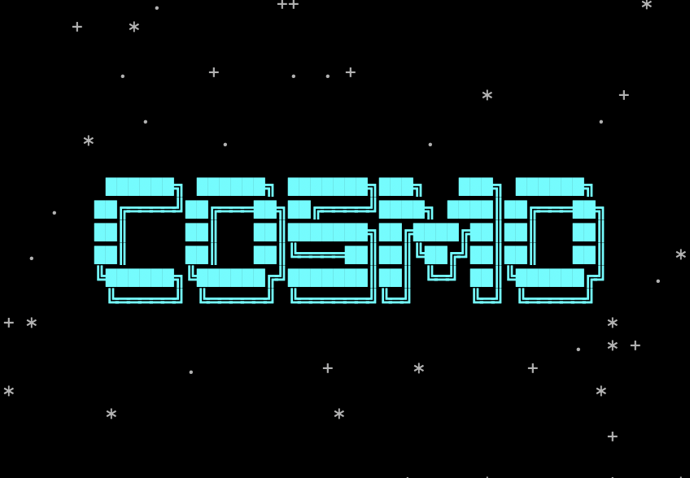

# Cosmo



A personal arXiv paper filter with a terminal UI. Cosmo fetches new papers
across the full range of physics categories, summarizes and embeds them,
learns my preferences and displays what I'd like to read from my own labels, and automatically emails me the top picks each day — so I don't have to scroll arXiv listings manually anymore.

## Why

I have a physics background (ion traps, MR-TOF-MS instrumentation, ATLAS/Higgs
detector work) and wanted something better than manually skimming arXiv
listings across a dozen categories every day. Cosmo is both a practical daily
tool to stay in touch with the field while also improving my ML skills with building an
end-to-end applied pipeline (embeddings → classification → active learning
→ automated delivery).

## The app

Cosmo runs as a [Textual](https://github.com/Textualize/textual) TUI (`app.py`),
styled with a Tokyo Night theme. Launch it with `cosmo` once installed (see
Setup), or `python app.py` from the Cosmo folder.

| Screen | What it does |
|---|---|
| **Welcome** | ASCII "COSMO" banner + starfield. Smart-continues into fetching, labeling, or the choice menu depending on whether today's papers are ready and whether the labeling goal is met. |
| **Categories** | Checkbox multi-select over every arXiv physics category, grouped into collapsible sections (astro-ph, cond-mat, nlin, physics, and other core categories like `hep-ph`/`quant-ph`/`gr-qc`). Checking a category reveals a curated list of keywords beneath it (e.g. "Dark Energy" under `astro-ph.CO`) — check any that match your interests to give matching papers a small score boost. You can also list preferred authors here — any paper by a listed author is always included in your daily email regardless of classifier score (matched by first initial + last name). All selections are saved and reused automatically. |
| **Fetch** | Runs fetch → summarize → embed as a background worker, with a log, progress bar with ETA, and Terraria-style flavor text while it works. |
| **Label** | Interactive labeling loop (`y`/`n`/`s`/`b`, plus `d`/`r` for on-demand explanations, `o` to open the paper in your browser). Each paper shows its categories, any of your keywords it matches, and a ★ badge if it's by a preferred author. Tracks progress toward a baseline goal of 50 "interesting" + 50 "not interesting" labels; switches from progress bars to plain running counts once that goal is met. |
| **Choice menu** | Once the baseline goal is hit: **Cosmo Papers** (browse the classifier's top 10 picks), **Daily Labeling** (a quick 5-paper active-learning session), **Indefinite Labeling** (keep going with no set goal), or **Starred Papers** (everything you've starred so far). |
| **Cosmo Papers** | Browse the classifier's top-scored unlabeled papers. `s` stars a paper — writing it to `labels.csv` as a *triple-weighted* positive label and saving a full copy to your starred list — `x` marks it not interesting. |
| **Starred Papers** | Every paper you've starred, organized as a **Field → Keyword → Paper** tree (e.g. Astrophysics → Galaxies → paper). Papers matching several of your keywords appear under each; papers matching none go under "Other". Opening one gives the same detail view as Cosmo Papers. |
| **Daily Labeling** | Uses uncertainty sampling to pick the 5 papers the classifier is least confident about — the highest-value 5 minutes of labeling you can do. Completing it shows a congratulations screen with streak tracking, current classifier accuracy, an "on this day in physics" fact, and a physics pun. |
| **Settings** (`g` from anywhere) | Email opt-in, address, daily/weekly frequency (+ weekday), how many papers to send, and desktop notification toggle. |

Every screen has a `h` help overlay listing its keybindings, and quitting is
always safe — labels flush to disk immediately, so nothing is lost mid-session.

## Pipeline

```
fetch → summarize → embed → classify → label / review → email
```

| Stage | Script | What it does |
|---|---|---|
| Fetch | `fetch.py` | Pulls new papers from arXiv's daily RSS feed for whichever categories are selected; aware of weekends/holidays when arXiv doesn't post. Also holds the curated per-category keyword bank (`CATEGORY_KEYWORDS`). |
| Summarize | `summarize.py` | Plain-language abstract summaries via a local seq2seq model, with LaTeX cleanup so equations don't garble output. |
| Embed | `embed.py` | SPECTER embeddings (`sentence-transformers/allenai-specter`) for every paper, incremental — only new papers get re-embedded. |
| Classify | `classify.py` | Trains a logistic regression classifier on frozen embeddings against `labels.csv`; also scores unlabeled papers and picks out the ones the classifier is most uncertain about, for active-learning-style labeling. Each of your checked keywords found in a paper's title or abstract adds +0.01 to its score. A keyword counts once per paper, even if the paper is cross-listed under several categories where you checked it. |
| Label / Review | `label.py`, `review.py` | Interactive labeling (with on-demand explanations via `api.py`), and classifier-ranked review — this is what powers the Label, Cosmo Papers, Daily Labeling, and Starred Papers screens. |
| Email | `cosmo_email.py` | Trains the classifier, scores the day's fetch, and emails the top picks. Can run standalone (for scheduled/automated runs) or get triggered from within the app after a fetch completes. |

## Automated daily email

`cosmo_email.py` is a standalone script (`run_daily_pipeline()`) that fetches,
summarizes, embeds, and — if you've opted in via Settings — emails your top
picks, all without opening the app. It:

- Skips days arXiv doesn't post (weekends/holidays)
- Only runs once per day (tracked via `last_auto_run_date` in `preferences.json`)
- Sends daily or on a chosen weekday, with a configurable number of papers per email (default 10)
- Formats the email as HTML, with papers grouped by field
- Always includes papers by any preferred author, in their own section at the top of the email, on top of the configured paper count
- Sends via Gmail SMTP using an app password (`gmail_credentials.txt`, gitignored)
- Optionally fires a desktop notification (via `plyer`, if installed) when an email goes out

`app.py` auto-installs a background scheduled task for this on launch (via
`scheduler_setup.py` — launchd on macOS, Task Scheduler on Windows, cron on
Linux), so once it's set up, the daily email keeps running even when Cosmo
isn't open.

## Setup

Setup is three parts: install Cosmo for your platform, add your credential
files, then launch it once. You'll need Python 3.11+.

### 1. Install

Pick your platform below. Each command downloads Cosmo into a
`Cosmo-ArXiv-Filter-main` folder in whatever directory you run it from,
installs the Python packages, and sets up the `cosmo` command.

<details>
<summary><b>macOS / Linux</b></summary>

Open Terminal. Cosmo will be saved in whichever folder Terminal is open in, which is your home folder by default.

To save it somewhere else, first type `cd` followed by the folder you want and press Enter. For example:

```bash
cd ~/Projects
```

Then paste this and press Enter:

```bash
curl -L https://github.com/tj-griffiths/Cosmo-ArXiv-Filter/archive/refs/heads/main.zip -o cosmo.zip && unzip cosmo.zip && rm cosmo.zip && cd Cosmo-ArXiv-Filter-main && chmod +x install.sh && ./install.sh
```

`install.sh` adds a `cosmo` alias to your shell profile (`~/.zshrc` or
`~/.bash_profile`). Open a new terminal window afterwards for it to take effect.

**macOS only — Full Disk Access.** If Cosmo lives inside `Documents`,
`Desktop`, or `Downloads`, macOS blocks the background daily-email task from
accessing that folder. It fails silently, leaving a `daily_run_error.log` full
of `Operation not permitted` errors. To fix it once, open System Settings →
Privacy & Security → Full Disk Access. Add `/bin/bash`, and add the exact
Python path shown inside the `CosmoPapers` file in your Cosmo folder (run
`cat CosmoPapers` to see it). Running the install command from somewhere
outside those three folders (e.g. your home folder) avoids this step entirely.

</details>

<details>
<summary><b>Windows (PowerShell)</b></summary>

Open PowerShell from the Start menu (normally, not "Run as administrator"). Cosmo will be saved in whichever folder PowerShell is open in, which is your user folder (`C:\Users\YourName`) by default.

To save it somewhere else, first type `cd` followed by the folder you want and press Enter. For example, to use a Projects folder inside your user folder:

```powershell
cd $HOME\Projects
```

Then paste this and press Enter:

```powershell
$ProgressPreference='SilentlyContinue'; Invoke-WebRequest -Uri https://github.com/tj-griffiths/Cosmo-ArXiv-Filter/archive/refs/heads/main.zip -OutFile cosmo.zip; Expand-Archive cosmo.zip -DestinationPath . -Force; Remove-Item cosmo.zip; cd Cosmo-ArXiv-Filter-main; powershell -ExecutionPolicy Bypass -File .\install.ps1
```

The installer downloads Cosmo's Python packages, then sets up a `cosmo` command you can use from any new PowerShell or Command Prompt window. If you use conda and your prompt starts with `(base)`, the installer will stop and ask you to create a separate environment first. The conda instructions below walk through that.

If `python` isn't recognized, install Python from
[python.org](https://www.python.org/downloads/) and tick **"Add python.exe to
PATH"** during setup. The `python` that ships with Windows by default is only a
shortcut to the Microsoft Store.

</details>

<details>
<summary><b>Using conda instead of pip (any platform)</b></summary>

Conda users set up Cosmo in three stages: download it, create the conda environment, then run the installer.

**1. Choose where to save it.** As with the other methods, Cosmo is saved in whichever folder your terminal is open in. `cd` to the folder you want first, e.g. `cd ~/Projects` on macOS/Linux, or `cd $HOME\Projects` on Windows. (Create the folder first if it doesn't exist yet.)

On Windows, open **Anaconda PowerShell Prompt** from the Start menu rather than regular PowerShell, so the `conda` commands work.

**2. Download Cosmo and create the environment.**

macOS / Linux:

```bash
curl -L https://github.com/tj-griffiths/Cosmo-ArXiv-Filter/archive/refs/heads/main.zip -o cosmo.zip && unzip cosmo.zip && rm cosmo.zip && cd Cosmo-ArXiv-Filter-main && conda env create -f environment.yml && conda activate cosmo
```

Windows:

```powershell
$ProgressPreference='SilentlyContinue'; Invoke-WebRequest -Uri https://github.com/tj-griffiths/Cosmo-ArXiv-Filter/archive/refs/heads/main.zip -OutFile cosmo.zip; Expand-Archive cosmo.zip -DestinationPath . -Force; Remove-Item cosmo.zip; cd Cosmo-ArXiv-Filter-main; conda env create -f environment.yml; conda activate cosmo
```

**3. Run the installer in the same window**, so it uses the conda environment:

macOS / Linux:

```bash
chmod +x install.sh && ./install.sh
```

Windows:

```powershell
powershell -ExecutionPolicy Bypass -File .\install.ps1
```

This makes the `cosmo` command always use the conda environment, so there's no need to activate it each time.

</details>

### 2. Add your credentials

Only `user_config.txt` is required — Cosmo runs fully without any of the
others. Add the rest only if you want that specific feature; skip anything
you don't care about.

Each one is a plain text file **you create yourself**, saved directly inside
the Cosmo folder (the same folder `app.py` lives in). They're already listed
in `.gitignore`, so they're safe from ever being committed.

**Required**

- `user_config.txt` — one line, your email:

`your.email@example.com`

  Used only to build a polite identifying string when Cosmo requests papers from arXiv.

**Optional — AI explanations (the `d`/`r` keys on labeling screens)**

- Get a free key at [console.groq.com/keys](https://console.groq.com/keys).
- Create a file named `groq_api_key.txt` in the Cosmo folder.
- Paste just the key as the only line in that file:

`gsk_abcdefghijklmnopqrstuvwxyz1234567890ABCD`

- Save it, then (re)launch Cosmo — the `d`/`r` explanation keys will now work on the labeling screens.
- Skip this and those two keys simply won't show up; nothing else about Cosmo is affected.
- *(Advanced/optional: a `GROQ_API_KEY` environment variable works instead of the file if you already use those. A `groq_model.txt` file can override the default AI model, but the default is fine for most people — ignore this unless you have a reason to change it.)*

**Optional — daily email digest**

- Create a file named `gmail_credentials.txt` in the Cosmo folder.
- Two lines: your Gmail address, then a Gmail [app password](https://myaccount.google.com/apppasswords) (a 16-character code Google generates — not your normal Gmail password):

`your.email@gmail.com`

`abcdabcdabcdabcd`

- Turn email on inside Cosmo itself: press `g` from anywhere to open Settings, and enable it there.
- Skip this and email just stays off — no errors, no reminders.

**Optional — desktop notifications**

- Run `pip install plyer` (or `conda install -c conda-forge plyer` if you're using conda).
- No file to create — once installed, Cosmo will pop a system notification when the daily email goes out.
- Skip this and notifications just don't appear.


### 3. Launch

Type `cosmo` in a new terminal window. On first launch you'll pick your
categories, keywords, and preferred authors, then Cosmo fetches today's papers
and walks you into labeling. The background daily-email task installs itself
automatically on that first launch.

`preferences.json` and `starred_papers.json` are created and maintained
automatically. They hold your selected categories, keywords, preferred authors,
email settings, labeling streaks, cached daily picks, and full copies of the
papers you've starred.

## Project structure

```
Cosmo/
├── app.py               # Textual TUI — main entry point
├── cosmo_email.py        # Standalone automated fetch + classify + email pipeline
├── scheduler_setup.py    # Installs the background task that runs cosmo_email.py automatically
├── fetch.py              # arXiv RSS ingestion + per-category keyword bank
├── summarize.py          # Abstract summarization
├── embed.py              # SPECTER embeddings
├── classify.py           # Classifier training, scoring, keyword boost, uncertainty sampling
├── label.py              # Labeling logic + on-demand explanations
├── review.py             # Classifier-ranked review logic
├── api.py                # Groq API wrapper for explanations
├── text_utils.py         # LaTeX/Unicode cleanup
├── history.py            # "On this day in physics" facts
├── run_pipeline.py       # CLI orchestrator (fetch → summarize → embed → label)
├── install.sh